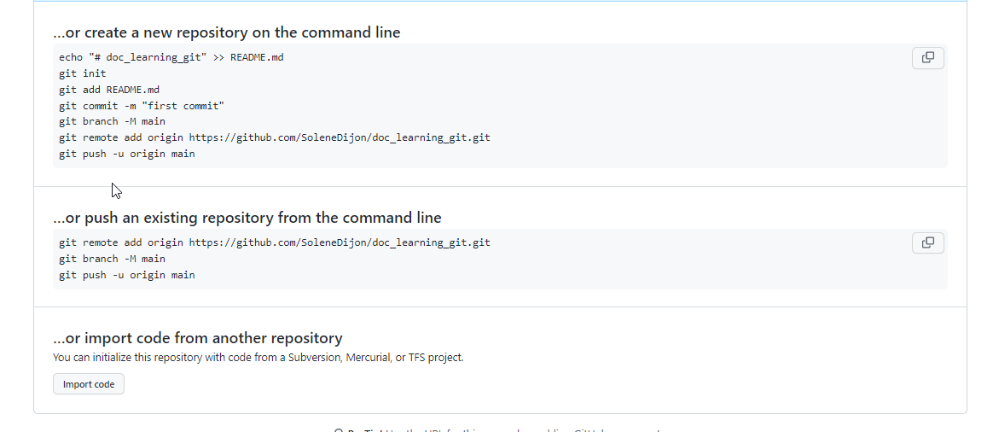

# Git et Github 

Le git est utilisé pour contrôler les versions en sauvegardant les modifications apportées. Git est utilisé localement, tandis que github est mis à disposition sur internet et utilise le cloud pour stocker les données. On peut ainsi partager les versions de son code sur internet en utilisant Github.

# Commandes Git pour ajouter un nouveau fichier

Les commandes sont à executer sur git bash. Git bash est un terminal qui permet d'executer des lignes de commandes Git sur le système d'exploitation. 


- Définir votre nom d'utilisateur et votre adresse mail : 
`git config --global user.name "FIRST_NAME LAST_NAME"`
`git config --global user.email "MY_NAME@example.com"`
- Créer un dépôt (repository) 'newFolder' n'importe où dans votre ordinateur. Sur GitHub, créer un nouveau dossier 'newFoler'. Si vous ajouter un fichier README sur github dans 'newFolder', utiliser la commande `git push` pour récupérer ce fichier en local. 
- Les commandes vous sont ensuite décrites :
   

- Sur git bash, aller dans le dossier 'newFolder'. 
  `cd C:/Users/Acs/OneDrive/Documents/newFolder`
- Initialisez le répertoire local en tant que référentiel Git.
  `git init`
- Ajouter les changements à la zone de staging ou zone d'index. Cette zone correspond à un simple fichier, généralement situé dans le répertoire Git, qui stocke les informations concernant ce qui fera partie du prochain “commit”.
 `git add .  `
 - Par « git status », vous pouvez voir le statut des fichiers. 
 `git status  `
 - Validez les fichiers que vous avez mis en place dans votre référentiel local. 
 `git commit -m "First commit" `

 - copier l'url du répertoire dans github. Dans git bash, ajoutez l’URL de votre référentiel où votre référentiel local sera poussé.
`git remote add origin repository_URL`
-transférez les modifications de votre référentiel local vers GitHub.
`git push -u origin main`

# Commandes Git pour mettre à jour un fichier sur GitHub*
```
git add .
git commit -m 'mon message'
git push
```